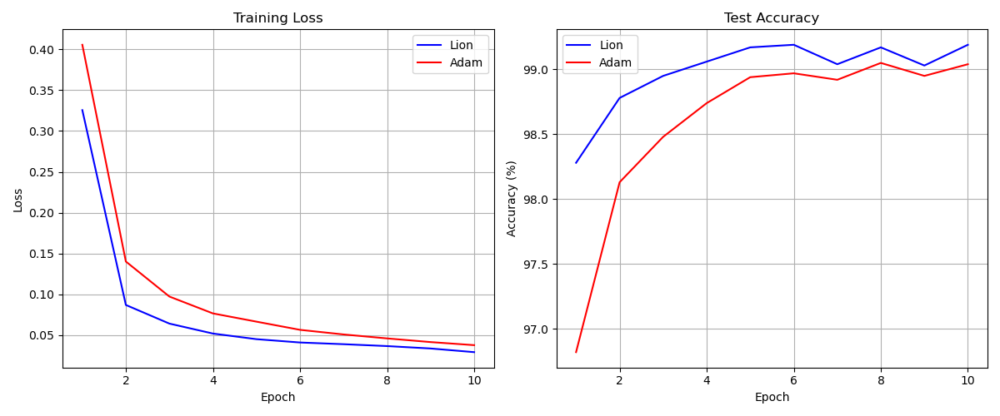

### №1
Сравнение написанной rmsnorm со встроенной:
```
Using device: cuda
Maximum difference between outputs: 0.000005
Mean difference between outputs: 0.000001
```

### №2
Custom implementation - градиенты рассчитаны вручную
PyTorch implementation - автоматически
```
Comparing implementations for x=1.0, y=0.7853981633974483:

Function values:
Custom implementation: 3.4253885746002197
PyTorch implementation: 3.4253885746002197
Difference: 0.0

gradients with respect to x:
custom implementation: 2.7182817459106445
pytorch implementation: 2.7182817459106445
difference: 0.0

gradients with respect to y:
custom implementation: -0.7071067690849304
pytorch implementation: -0.7071067690849304
difference: 0.0
```

### №3
Обучение простой модели на mnist. Сравнение оптимизаторов
